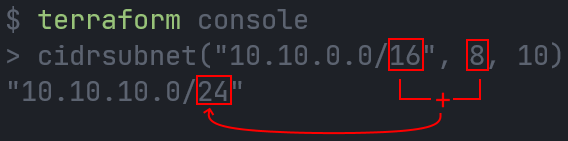
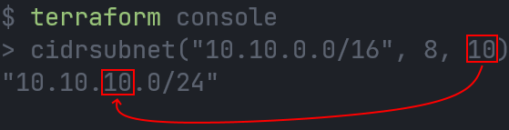
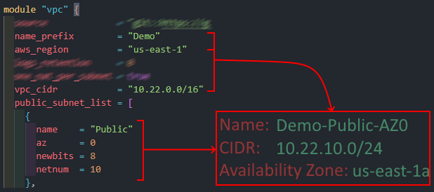

# AWS VPC Terraform Module

Terraform Module to deploy a VPC

```bash
module "vpc" {
  source                    = "git::https://github.com/JManzur/aws-vpc.git?ref=v1.1.3"
  name_prefix               = "Demo"
  aws_region                = "us-east-1"
  logs_retention            = 0
  vpc_flow_logs_destination = "S3"
  one_nat_per_subnet        = true
  vpc_cidr                  = "10.22.0.0/16"
  public_subnet_list = [
    {
      name    = "Public"
      az      = 0
      newbits = 8
      netnum  = 10
    },
    {
      name    = "Public"
      az      = 1
      newbits = 8
      netnum  = 11
    }
  ]
  private_subnet_list = [
    {
      name    = "Private"
      az      = 0
      newbits = 8
      netnum  = 20
    },
    {
      name    = "Private"
      az      = 1
      newbits = 8
      netnum  = 21
    }
  ]
}
```


## `cidrsubnet` Function:

`cidrsubnet` calculates a subnet address within a given IP network address prefix.

```hcl
cidrsubnet(prefix, newbits, netnum)
```

- The `cidrsubnet` function required the following inputs:
  - `prefix`: The VPC CIDR block in 0.0.0.0/0 format.
    - **Example**: 10.22.0.0/16
  - `newbits`:  The number of bits to be added to the netmask.
    - **Example**: If prefix netmask=16, and  newbits=8, then 16+8=24
    - 
  - `netnum`: The number to be added in the third octet of the CIDR block.
    - **Example**: If prefix=10.22.0.0 and netnum=10, then 10.22.0.0 becomes 10.22.10.0
    - 

### Full example of the resulting CIDR, naming, and AZ assignment:


